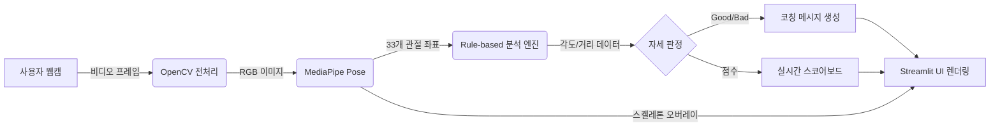

# 데이터 흐름도 (DFD)

> **작성 시점**: Day 11
> **시스템 내에서 데이터가 어떻게 이동하고 변환되는지 시각화한다.**

---

---

## 흐름 설명
1. **입력**: 사용자의 웹캠 영상을 실시간으로 캡처합니다.
2. **AI 분석**: MediaPipe Pose를 통해 신체 주요 관절의 3D 좌표를 추출합니다.
3. **규칙 엔진**: 추출된 좌표를 바탕으로 무릎 각도, 상체 기울기 등을 계산하고 미리 정의된 스쿼트 규칙과 비교합니다.
4. **출력**: 판정 결과에 따른 코칭 메시지와 점수, 그리고 스켈레톤 가이드라인을 화면에 동시에 표시합니다.

---
**작성자**: FitCheck AI Team
**최종 갱신**: 2026-05-13
