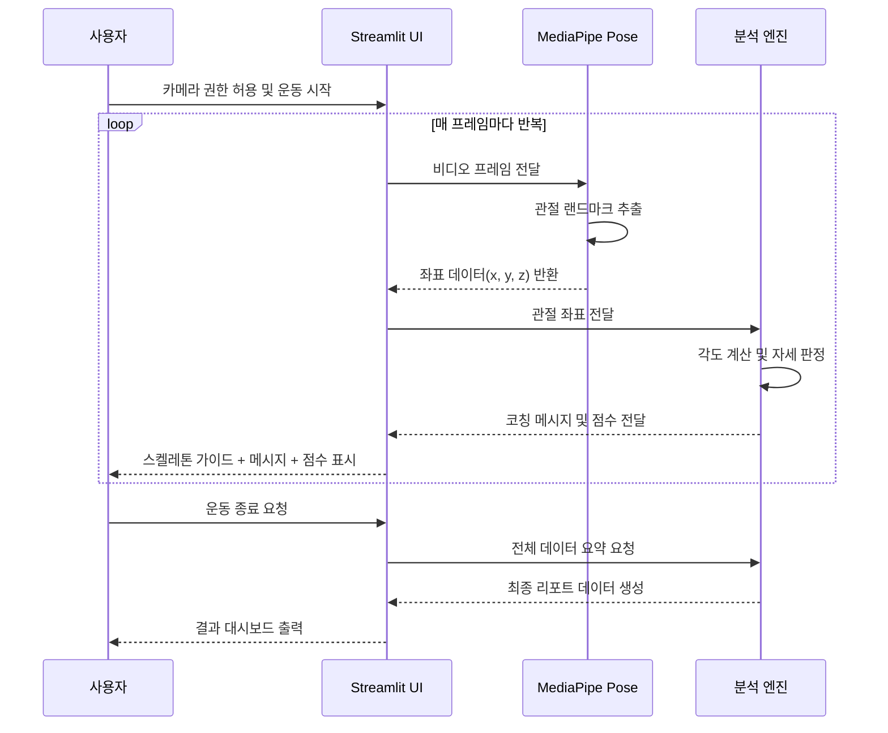

# 시퀀스 다이어그램 (Sequence)

> **작성 시점**: Day 11
> **사용자 인터랙션에 따른 시스템 내부의 동작 순서를 정의한다.**

---

---

## 주요 단계
1. **초기화**: 사용자가 웹캠 접근을 허용하면 MediaPipe 모델이 로드됩니다.
2. **실시간 루프**: 프레임 단위로 '추출 -> 계산 -> 피드백' 프로세스가 지연 없이 수행됩니다.
3. **세션 종료**: 운동이 끝나면 누적된 데이터를 바탕으로 종합적인 피드백 리포트를 생성합니다.

---
**작성자**: FitCheck AI Team
**최종 갱신**: 2026-05-13
